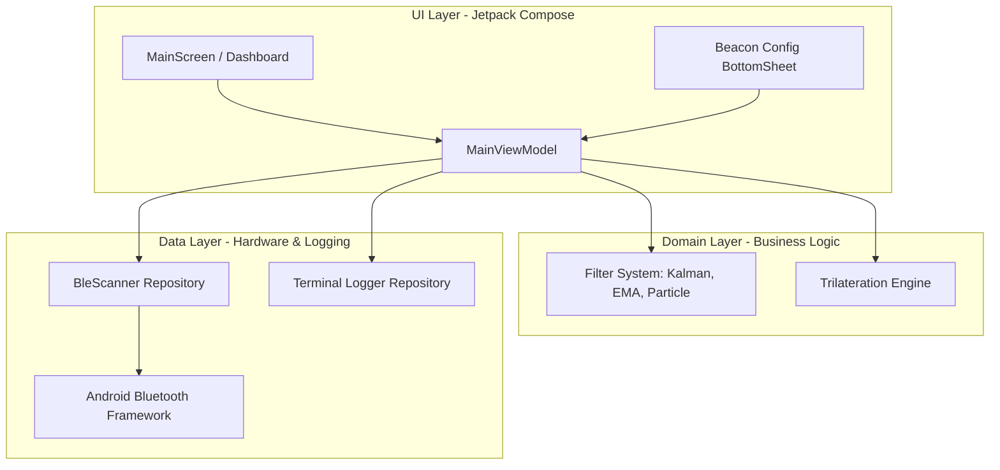

# Implementation Plan: BeaconScope (BLE Beacon Signal Analyzer & Trilateration)

This document provides a highly structured implementation plan for building **BeaconScope**, a modern, responsive Android application designed for BLE beacon scanning, RSSI signal filtering, and real-time 2D trilateration positioning.

---

## 1. Architectural Blueprint (MVVM + Clean Architecture)

To ensure high performance, separation of concerns, and clean testing boundaries, BeaconScope will use a modern **MVVM (Model-View-ViewModel)** architecture built on Jetpack Compose and Kotlin Coroutines/Flows.



### Proposed Directory Structure
```text
com.orion.beaconscope/
│
├── data/
│   ├── model/
│   │   ├── BeaconConfig.kt        # MAC, Label, Coordinates (X, Y), TxPower
│   │   ├── BeaconSignal.kt        # Raw RSSI, Filtered RSSI, Distance, Timestamp
│   │   └── LogEntry.kt            # Terminal log entries (Timestamp, Beacon ID, Message)
│   ├── repository/
│   │   ├── BleScannerRepository.kt # Handles Bluetooth LE scanning & flow of raw readings
│   │   └── LogRepository.kt        # In-memory circular buffer for terminal logs
│
├── domain/
│   ├── filter/
│   │   ├── SignalFilter.kt        # Interface for signal filters
│   │   ├── KalmanFilter.kt        # Kalman filtering logic
│   │   ├── EmaFilter.kt           # Exponential Moving Average filtering logic
│   │   └── ParticleFilter.kt      # Particle filtering logic
│   └── trilateration/
│       ├── TrilaterationEngine.kt  # 2D Least-Squares Trilateration solver
│       └── MathUtils.kt           # Path-loss formula & matrix helper functions
│
├── ui/
│   ├── theme/
│   │   ├── Color.kt               # Technical dark palette (Neon green, deep gray, alerts)
│   │   ├── Theme.kt
│   │   └── Type.kt                # Monospace fonts for logs, clean Inter-like font for UI
│   ├── components/
│   │   ├── BeaconCard.kt          # Individual beacon details, real-time graph, terminal
│   │   ├── LiveRssiGraph.kt       # Custom Canvas / MPAndroidChart real-time signal line chart
│   │   ├── LogTerminal.kt         # Monospaced expandable terminal log output
│   │   └── RadarPositionView.kt   # Interactive 2D canvas plotting Beacons and Estimated User Location
│   ├── MainViewModel.kt           # Coordinates scanning, filtering, and trilateration states
│   └── MainScreen.kt              # Root Composable layout with TopBar, Grid, and Radar Map
```

---

## 2. Dynamic Filtering & Mathematical Models

To solve the severe noise and environmental fluctuations in BLE RSSI, three core filters will be implemented.

### A. Exponential Moving Average (EMA) Filter
A lightweight, memory-efficient low-pass filter.
$$\text{Filtered RSSI}_t = \alpha \cdot \text{Raw RSSI}_t + (1 - \alpha) \cdot \text{Filtered RSSI}_{t-1}$$
*   **Parameter $\alpha$ (Alpha):** Smoothness factor $[0.0, 1.0]$. A lower $\alpha$ values provide smoother results but introduce latency/lag in motion tracking.

### B. One-Dimensional Kalman Filter
An optimal estimator that tracks the true signal state amidst Gaussian noise by alternating prediction and measurement update phases.
1.  **Predict Phase:**
    $$\hat{x}_{t|t-1} = \hat{x}_{t-1}$$
    $$P_{t|t-1} = P_{t-1} + Q$$
2.  **Update Phase:**
    $$K_t = \frac{P_{t|t-1}}{P_{t|t-1} + R}$$
    $$\hat{x}_t = \hat{x}_{t|t-1} + K_t \cdot (z_t - \hat{x}_{t|t-1})$$
    $$P_t = (1 - K_t) \cdot P_{t|t-1}$$
*   **Parameters:**
    *   $Q$ (Process Noise): Represents how much the real RSSI can change on its own per unit of time (typically $0.001$ to $0.1$).
    *   $R$ (Measurement Noise): Represents sensor precision/variance (typically $1.0$ to $10.0$ for BLE).

### C. 1D Particle Filter
A sequential Monte Carlo method using a set of "particles" to represent the probability distribution of the RSSI.
1.  **Initialization:** Distribute $N$ particles randomly around the first received RSSI value.
2.  **Prediction:** Add Gaussian process noise to each particle: $x_i^{(t)} = x_i^{(t-1)} + \mathcal{N}(0, \sigma_{\text{process}})$.
3.  **Weighting:** Update particle weights based on how close they are to the new measurement $z_t$:
    $$w_i = \exp\left( -\frac{(x_i - z_t)^2}{2 \sigma_{\text{measurement}}^2} \right)$$
    Normalize weights so that $\sum w_i = 1$.
4.  **Resampling:** Select $N$ new particles from the current set with replacement, biased by weight $w_i$.
5.  **State Estimation:** Compute the mean/median of the particle cloud as the filtered RSSI.

---

## 3. Distance & 2D Trilateration Engine

### Step 1: Distance Estimation (Log-Distance Path Loss Model)
$$d = 10^{\frac{\text{TxPower} - \text{RSSI}}{10 \cdot n}}$$
*   $\text{TxPower}$: Measured RSSI at $1$ meter.
*   $n$: Path loss exponent (typically $2.0$ in free space, $3.0 - 4.0$ in complex indoor environments).

### Step 2: 2D Least Squares Trilateration
Given 3 beacons at coordinates $(x_1, y_1)$, $(x_2, y_2)$, and $(x_3, y_3)$ with estimated distances $d_1, d_2, d_3$:
$$(x - x_i)^2 + (y - y_i)^2 = d_i^2 \quad \text{for } i \in \{1, 2, 3\}$$

By expanding the equations and subtracting the 3rd equation from the first two, we linearize the system into $A\mathbf{x} = \mathbf{b}$:
$$\begin{bmatrix} 
2(x_1 - x_3) & 2(y_1 - y_3) \\ 
2(x_2 - x_3) & 2(y_2 - y_3) 
\end{bmatrix} 
\begin{bmatrix} x \\ y \end{bmatrix} = 
\begin{bmatrix} 
x_1^2 - x_3^2 + y_1^2 - y_3^2 + d_3^2 - d_1^2 \\ 
x_2^2 - x_3^2 + y_2^2 - y_3^2 + d_3^2 - d_2^2 
\end{bmatrix}$$

We can solve this directly using the standard pseudo-inverse least-squares formula:
$$\mathbf{x} = (A^T A)^{-1} A^T \mathbf{b}$$

---

## 4. Open Questions Resolution & Design Decisions

Based on informatics engineering best practices, we propose the following concrete decisions for these open questions:

| Open Question | Recommended Decision | Rationale |
| :--- | :--- | :--- |
| **1. Identical Tx power?** | **Configurable Per Beacon** | Different beacon manufacturers have different calibrated $1$m TxPower. Defining this per-beacon ensures accurate distance mapping. |
| **2. Beacon coordinates static or configurable?** | **Configurable with static defaults** | Pre-populate with typical setup coordinates (e.g. $B_1(0,0)$, $B_2(5,0)$, $B_3(2.5, 4.33)$) but provide a dialog to adjust coordinates to match physical rooms. |
| **3. Trilateration dimension?** | **2D Only ($Z = 0$ constant)** | 3D positioning with only 3 beacons is highly unstable and mathematically underdetermined. Keeping Z static guarantees stable X/Y tracking. |
| **4. Filter scope?** | **Global Selector, Local State** | Changing the filter type applies to all 3 beacons globally for side-by-side comparison, but each beacon maintains its own internal mathematical state/history. |
| **5. Visible raw RSSI?** | **Yes, overlayed on the graph** | Visualizing raw vs. filtered RSSI in real-time allows immediate visual validation of filter stability and lag performance. |

---

## 5. UI/UX Design System (Technical Monitoring Dashboard)

The app will feature a sleek, premium **glassmorphic dark UI** that looks like a telemetry dashboard:

*   **Primary Palette:** Deep Gray (`#121824`), Slate (`#1E293B`), Tech Neon Blue/Green (`#10B981` or `#38BDF8`), Warning Orange (`#F59E0B`), Alert Red (`#EF4444`).
*   **Dashboard Layout:**
    *   **Header**: Main Scan switch, Filter Selector (Kalman, EMA, Particle), Configuration button.
    *   **2D Radar Canvas**: A beautiful responsive plot showing the 3 beacon locations and a pulsating glowing point representing the user's estimated trilaterated location.
    *   **Beacon Cards (3 column/row layout)**:
        *   Live miniature line graph comparing raw vs filtered RSSI.
        *   Diagnostic data readout (MAC, raw/filtered RSSI, current distance estimate).
        *   Expandable monospaced telemetry terminal scrolling live data logs.

---

## 6. Phased Implementation Roadmap

### Phase 1: Core Foundation & BLE scanning
*   Configure project files, Android Manifest permissions (Fine Location, Bluetooth Scan/Connect).
*   Create `BleScannerRepository` implementing high-stability scanning with filters for MAC addresses.
*   Establish MVVM structure with `MainViewModel` publishing scanned states via `StateFlow`.

### Phase 2: Live Visualization & Terminal
*   Build the base Compose shell containing `MainScreen` and the 3-beacon layout grid.
*   Develop the custom canvas `LiveRssiGraph` that dynamically plots incoming signals.
*   Implement `LogTerminal` component displaying real-time scrolling diagnostic logs.

### Phase 3: Mathematical Filters
*   Implement `SignalFilter` interface.
*   Develop `EmaFilter`, `KalmanFilter` (with adjustable noise covariance parameters), and `ParticleFilter`.
*   Integrate filters dynamically into `MainViewModel` process pipelines.

### Phase 4: Trilateration & 2D Telemetry Plot
*   Implement `MathUtils` path-loss estimator and 2D least-squares matrix linear algebra solver.
*   Add the `RadarPositionView` Composable, rendering beacons as nodes and the estimated device location with error circles.
*   Refine smooth UI transitions and ensure overall scanning/filtering stability.

---

> [!TIP]
> **Performance Tip:** Since BLE updates can arrive multiple times per second per beacon, updating Jetpack Compose state too rapidly can cause lag. We will throttle StateFlow emissions to $100\text{ms}$ or $200\text{ms}$ intervals for UI updates, while keeping the mathematical filters processing every packet in the background thread.
